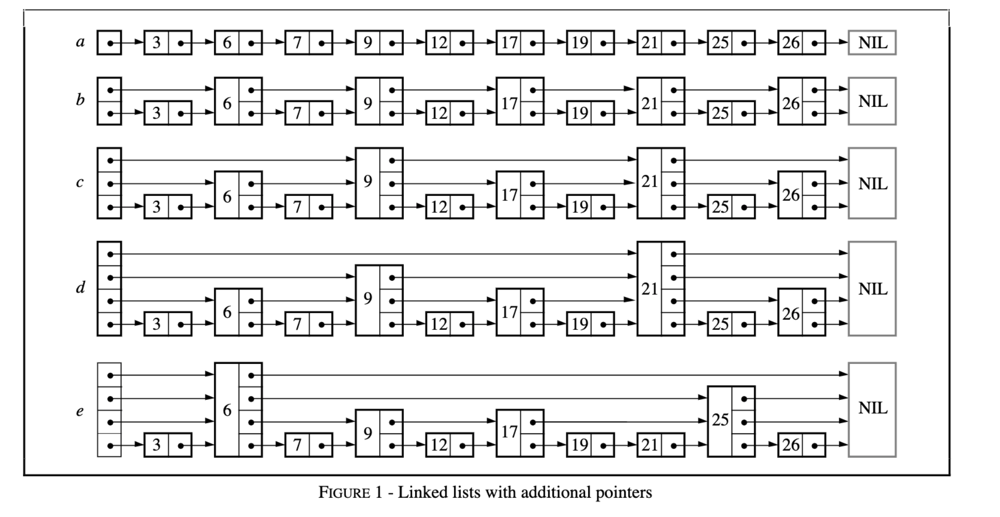
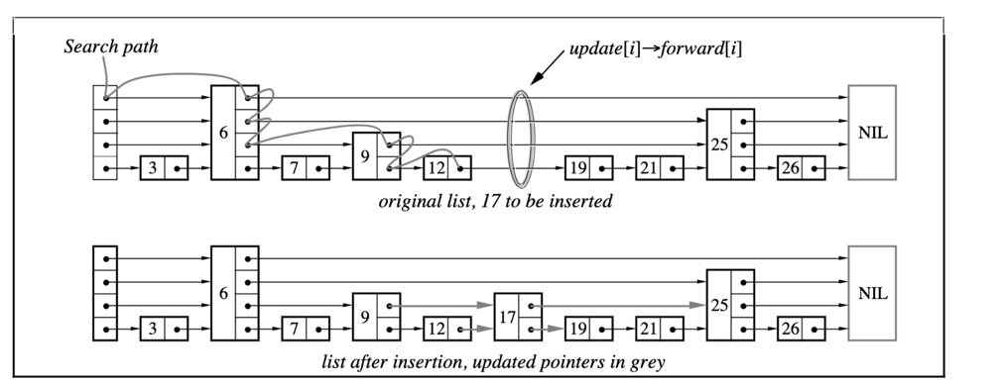

# 跳跃表

跳跃表是一种概率上平衡的数据结构，用来替换自平衡的二叉树。其查找的渐进时间复杂度与红黑树等自平衡的二叉树接近。



从图中可以看出，跳表在最底层实际上是一个链表，保存了按序排列的所有的数据结果

## 数据结构

数据结构有两层抽象

1. 跳表自身
    - 持有所有的头节点引用

```java
public class SkipList<Key, Value> extends AbstractMap<K, V> implements Serializable {
    /**
     * 最大层次
     */
    private static final int MAX_LEVEL = 32;

    /**
     * 每个节点插入的时候的 random 因子数大小
     * 用于生成其随机 level
     */
    private static final double LEVEL_FACTOR = 0.5D;

    /**
     * 当前的 level
     */
    private int level = 0;

    /**
     * 当前的大小
     */
    private int size = 0;

    /**
     * 遍历
     */
    private transient Set<Entry<K, V>> entrySet;

    /**
     * 当前 skip list 的头
     */
    private Node<K, V> head = new Node<>(null, null, MAX_LEVEL);

    /**
     * 当前 skip_list 的尾部
     * 主要用来判断 entry set 的尾部 当然如果不创建也是可以的
     */
    private Node<K, V> tail = new Node<>(null, null, MAX_LEVEL);

    /**
     * 比较器
     */
    private Comparator<K> comparator;
}
```

2. 跳表节点
    - 持有后续节点的引用（其大小为当前节点的层次高度）
    - 持有本节点的数据（key, val）

```java
private static class Node<K, V> implements Map.Entry<K, V> {

    private final K key;
    private V value;
    /**
     * debug 使用
     * 指示当前生成的层次是什么
     */
    private int level;
    /**
     * 当前这个节点在 i 层的前一个节点
     */
    private Node<K, V>[] pre;
    /**
     * 当前这个节点在这一层的后面的一个节点
     */
    private Node<K, V>[] last;
}
```

## 查询

查找要确定以下几个点

1. 查找的起始点
2. 在访问到这一层的尾部的时候，怎么跳转到下一层次



```java
public class SkipList {
    /* …… */

    /**
     * 找到距离 key 最近的数据
     *
     * @param key    需要找到的 key
     * @param update 需要
     *
     * @return 返回找到的最近的数据
     */
    private Node<K, V> findKey(K key, Node<K, V>[] update) {
        // 迭代的寻找
        Node<K, V> cur = head;
        // 层次
        for (int i = this.level - 1; i >= 0; i--) {
            // 在这一层中向右移动
            while (i < cur.last.length && cur.last[i] != null && this.compare(cur.last[i], key) < 0) {
                cur = cur.last[i];
            }
            if (update != null) {
                update[i] = cur;
            }
        }

        if (cur == null) {
            return null;
        }

        // 有可能找到 tail 这个时候 cur.last[0] == null
        return cur.last[0] == null ? null : this.compare(cur.last[0], key) == 0 ? cur.last[0] : null;
    }

    /* …… */
}

```

## 插入

**关键在于找到正好小于当前 key 的最右边的引用！即论文中的 update 数组**

1. 插入的层次大于当前的层次
    1. 对于小于当前层次的部分，需要关联到正好小于当前插入的 key 的数据后一位
    2. 对于大于当前层次的部分，head 指针只需要直接关联到当前的新节点即可
2. 插入的层次小于当前的层次（与 1.i 中相同）

```java
public class SkipList {

    /* …… */

    @Override
    public V put(K key, V val) {
        // update[i] 在查找 key 的过程中每一层级上的转折点
        // 即在插入 key val 后 update[i].last[i] -> 指向新插入的节点
        Node<K, V>[] update = new Node[MAX_LEVEL];

        // 找到数据
        Node<K, V> nearNode = this.findKey(key, update);

        // 如果 nearNode 不为 null 而且 key 相当 那么说明要更新
        if (nearNode != null && this.compare(nearNode, key) == 0) {
            V oldVal = nearNode.value;
            nearNode.value = val;
            return oldVal;
        }

        int randomLevel = this.randomLevel();
        // 要插入新的 node
        Node<K, V> newNode = new Node<>(key, val, randomLevel);

        // 如果随机的 level 比 curLevel 大 说明这个时候要在 curLevel -> randomLevel 的 head 上加入到 node Node 的链接
        if (randomLevel > this.level) {
            for (int i = this.level; i < randomLevel; i++) {
                // 用 update 来接 不直接关联 在下面的方法内再关联
                // pre: head.last[i] = newNode;
                // 这个时候直接前缀一定是 head
                update[i] = head;
            }
            this.level = randomLevel;
        }

        // 0 -> this.curLevel 则要换一种方式
        // 表达的含义是 update[i] 现在要关联到 newNode 上 而 newNode.last 要关联到 update[i].last 上
        for (int i = 0; i < randomLevel; i++) {
//            Node<K, V> last = update[i].last[i];
//            newNode.last[i] = last;
//            update[i].last[i] = newNode;
            // 向前关联 node
            this.linkNode(newNode, update[i].last[i], i);
            // 向后关联 Node
            this.linkNode(update[i], newNode, i);
        }

        this.size++;

        return null;
    }

    /* …… */
}
```

## 删除

1. 删除最高层次的数据，需要减少当前的层次
2. 需要连接删除的节点前的一个数据与后一个数据

```java
public class SkipList {
    /* …… */

    @Override
    @SuppressWarnings("unchecked")
    public V remove(Object key) {

        Node<K, V> findNode = this.findKey((K) key, null);
        // 没有找到数据
        if (findNode == null) {
            return null;
        }

        // 更改 update 的指向 以 删除引用
        for (int i = 0; i < findNode.level; i++) {
            // 关联前一个和后一个节点
            this.linkNode(findNode.pre[i], findNode.last[i], i);

            // 清除引用 防止无法回收
            findNode.pre[i] = null;
            findNode.last[i] = null;
        }
        // 判断是否要减少层次
        // 如果当前 head.last[level] == this.tail 说明要减少层次了 说明当前层次没有一个数据节点了
        while (this.level > 0 && this.head.last[this.level] == this.tail) {
            this.level--;
        }
        // 更改当前的大小
        this.size--;
        return findNode.getValue();
    }
    /* …… */
}
```